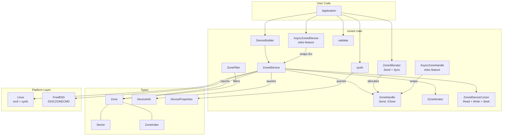
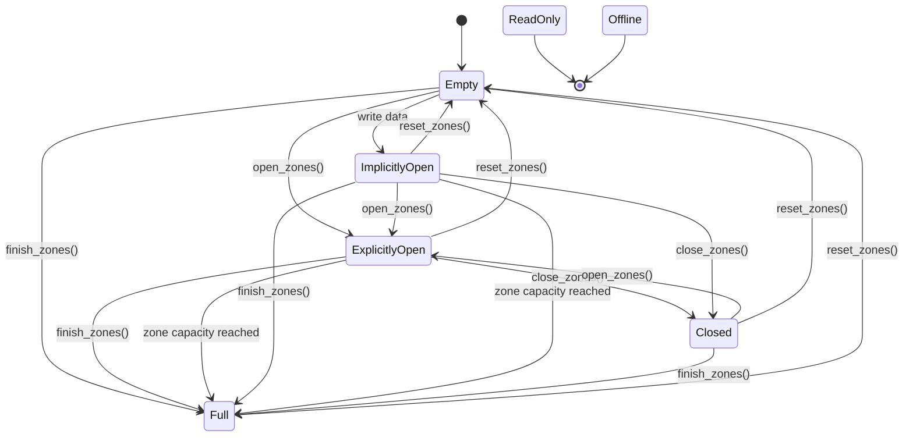

# zoned

Pure Rust library for zoned block device management (SMR/ZNS).

Provides a safe, idiomatic interface for interacting with Shingled Magnetic
Recording (SMR) hard drives and Zoned Namespace (ZNS) NVMe SSDs.

## Features

- **Zone reporting** with lazy iteration and client-side filtering
- **Zone management** — open, close, finish, reset
- **Data I/O** — positional read/write and vectored (scatter-gather) I/O
- **Cursor-based I/O** — `ZonedDeviceCursor` implements `std::io::Read`/`Write`/`Seek`
- **`std::io::Write`** on `ZoneHandle` — enables `BufWriter` and standard I/O adapters
- **Exclusive zone handles** — compile-time enforcement of single-owner writes via `ZoneHandle`
- **Thread-safe zone allocation** — `ZoneAllocator` for concurrent multi-zone workloads
- **Device validation** — block device, mount, partition, and zoned-model checks
- **Builder pattern** — composable device opening with opt-in validation
- **Newtype safety** — `Sector` and `ZoneIndex` prevent unit confusion at compile time
- **sysfs integration** — zone model, block sizes, scheduler, vendor/model, capacity
- **Async support** — optional `tokio` feature with `AsyncZonedDevice` and `AsyncZoneHandle`

## Platform Support

- **Linux**: Full support via kernel ioctls and sysfs (kernel 5.9+)
- **FreeBSD**: Support via `DIOCZONECMD` ioctl

## Architecture



## Zone Lifecycle

Zones transition through states via host commands and device writes:



> **Note:** Conventional zones remain in `NotWritePointer` and do not participate
> in this state machine — they allow random writes with no write pointer.

## Quick Start

Add `zoned` to your `Cargo.toml`:

```toml
[dependencies]
zoned = "0.1"
```

### Opening a Device and Reporting Zones

```rust
use zoned::{Sector, ZonedDevice, ZoneFilter, ZoneType, ZoneCondition};

fn main() -> zoned::Result<()> {
    // Open with full validation (block device, not mounted, no partitions, is zoned)
    let dev = ZonedDevice::builder("/dev/sdb")
        .validate_all()
        .open()?;

    // Query device info
    let info = dev.device_info()?;
    println!("{} zones, {} sectors each", info.nr_zones, info.zone_size);

    // Report the first 32 zones
    let zones = dev.report_zones(Sector::ZERO, 32)?;
    for zone in &zones {
        println!(
            "Zone at {}: {} ({}), capacity {}",
            zone.start, zone.zone_type, zone.condition, zone.capacity
        );
    }

    // Filter for empty sequential zones
    let filter = ZoneFilter::new()
        .zone_type(ZoneType::SequentialWriteRequired)
        .condition(ZoneCondition::Empty);
    let empty = dev.report_zones_filtered(&filter, 512)?;
    println!("{} empty sequential zones available", empty.len());

    Ok(())
}
```

### Lazy Zone Iteration

For large devices, iterate zones in batches instead of loading them all at once:

```rust
use zoned::{ZonedDevice, ZoneCondition};

fn main() -> zoned::Result<()> {
    let dev = ZonedDevice::open("/dev/sdb")?;

    // Fetch zones in batches of 64
    for result in dev.zone_iter(64) {
        let zone = result?;
        if zone.condition == ZoneCondition::Full {
            println!("Full zone at sector {}", zone.start);
        }
    }

    Ok(())
}
```

### Sequential Writes with ZoneHandle

`ZoneHandle` provides exclusive access to a single zone with a locally-tracked
write pointer — no device queries needed to know your position:

```rust
use std::io::Write;
use zoned::{ZonedDevice, ZoneIndex};
use std::sync::Arc;

fn main() -> zoned::Result<()> {
    let dev = Arc::new(ZonedDevice::open_writable("/dev/sdb")?);

    // Get exclusive handle to zone 5
    let mut handle = zoned::ZoneHandle::new(dev, ZoneIndex::new(5))?;

    // Reset the zone to start fresh
    handle.reset()?;

    // Sequential write — write pointer advances automatically
    let data = vec![0xABu8; 4096];
    handle.write_all_sequential(&data)?;

    // ZoneHandle implements std::io::Write, so BufWriter works
    let mut writer = std::io::BufWriter::new(&mut handle);
    writer.write_all(&[0u8; 8192])?;
    writer.flush()?;

    Ok(())
}
```

### Concurrent Writes with ZoneAllocator

`ZoneAllocator` hands out `ZoneHandle`s that are `Send` but not `Clone`,
so each zone has exactly one writer — enforced at compile time:

```rust
use std::sync::Arc;
use zoned::{ZonedDevice, ZoneAllocator};

fn main() -> zoned::Result<()> {
    let dev = Arc::new(ZonedDevice::open_writable("/dev/sdb")?);
    let allocator = ZoneAllocator::new(dev.clone());

    let mut handles = Vec::new();
    for _ in 0..4 {
        handles.push(allocator.allocate()?); // grabs next empty sequential zone
    }

    // Send each handle to its own thread
    let threads: Vec<_> = handles
        .into_iter()
        .map(|mut zone| {
            std::thread::spawn(move || {
                zone.reset().unwrap();
                zone.write_all_sequential(&vec![0u8; 131072]).unwrap();
            })
        })
        .collect();

    for t in threads {
        t.join().unwrap();
    }

    Ok(())
}
```

### Sysfs Queries (No Device Open Required)

```rust
use zoned::sysfs;

fn main() -> zoned::Result<()> {
    let props = sysfs::device_properties("/dev/sdb".as_ref())?;
    println!("Model:     {}", props.model);
    println!("Vendor:    {}", props.identity.vendor.as_deref().unwrap_or("N/A"));
    println!("Zones:     {}", props.geometry.nr_zones);
    println!("Zone size: {}", props.geometry.chunk_sectors);
    println!("Scheduler: {}", props.scheduler.as_deref().unwrap_or("none"));
    if let Some(max) = props.limits.max_open_zones {
        println!("Max open:  {}", max);
    }
    Ok(())
}
```

### Device Validation

Validate before opening to get clear error messages:

```rust
use zoned::validate;

fn main() -> zoned::Result<()> {
    let path = std::path::Path::new("/dev/sdb");

    validate::is_block_device(path)?;
    validate::is_not_mounted(path)?;
    validate::has_no_partitions(path)?;
    validate::is_zoned_device(path)?;

    // Or use the builder, which rolls these into one call:
    let dev = zoned::ZonedDevice::builder("/dev/sdb")
        .writable()
        .validate_all()
        .open()?;

    Ok(())
}
```

## Async Support

Enable the `tokio` feature for async wrappers that use `spawn_blocking`
internally — the same approach `tokio::fs` uses:

```toml
[dependencies]
zoned = { version = "0.1", features = ["tokio"] }
tokio = { version = "1", features = ["rt-multi-thread", "macros"] }
```

### Async Zone Reporting and I/O

```rust
use zoned::{Sector, ZoneIndex, async_api::AsyncZonedDevice};

#[tokio::main]
async fn main() -> zoned::Result<()> {
    let dev = AsyncZonedDevice::open_writable("/dev/sdb").await?;

    // Async zone report
    let zones = dev.report_zones(Sector::ZERO, 16).await?;
    for zone in &zones {
        println!("{}: {} ({})", zone.start, zone.zone_type, zone.condition);
    }

    // Async zone handle — write, then reset
    let mut handle = dev.zone_handle(ZoneIndex::new(5)).await?;
    handle.reset().await?;
    handle.write_sequential(vec![0u8; 4096]).await?;

    dev.fsync().await?;
    Ok(())
}
```

### Converting Between Sync and Async

```rust
use std::sync::Arc;
use zoned::{ZonedDevice, async_api::AsyncZonedDevice};

#[tokio::main]
async fn main() -> zoned::Result<()> {
    // Wrap an existing sync device
    let sync_dev = ZonedDevice::open("/dev/sdb")?;
    let async_dev = AsyncZonedDevice::from_sync(sync_dev);

    // Or from an Arc (useful when sharing with sync code)
    let shared = Arc::new(ZonedDevice::open("/dev/sdb")?);
    let async_dev = AsyncZonedDevice::from_arc(shared.clone());

    let info = async_dev.device_info()?; // non-blocking, no await needed
    println!("{} zones", info.nr_zones);
    Ok(())
}
```

## CLI Tool

The `zcli` example exercises the full library API and serves as a practical
tool for inspecting and managing zoned devices:

```bash
cargo build --release --example zcli

# Device info (read-only)
sudo ./target/release/examples/zcli info /dev/sda

# List empty sequential zones
sudo ./target/release/examples/zcli zones /dev/sda --type seq-req --cond empty --count 10

# Zone state transitions
sudo ./target/release/examples/zcli open /dev/sda 378
sudo ./target/release/examples/zcli finish /dev/sda 378
sudo ./target/release/examples/zcli reset /dev/sda 378 --yes

# Read/write with hex dump
sudo ./target/release/examples/zcli read /dev/sda 0 --bytes 512
sudo ./target/release/examples/zcli pwrite /dev/sda 0 --bytes 4096 --pattern 0xAA --yes

# Validation checks
sudo ./target/release/examples/zcli validate /dev/sda

# Concurrent write benchmark
sudo ./target/release/examples/zcli bench /dev/sda -t 4 -z 2 -b 512 --yes
```

Run `zcli --help` or `zcli <subcommand> --help` for full usage.

## Testing

```bash
# Unit tests (no hardware required)
cargo test

# Integration tests with emulated zoned device (requires root + null_blk module)
sudo cargo test --test nullblk_integration

# Read-only tests against a real device (requires /dev/sda to be a zoned device)
cargo test --test sda_integration
```

## Requirements

- Rust 1.88.0+ (edition 2024)
- Linux kernel 5.9+ (for full sysfs attribute support)
- Root or `disk` group membership for device access

## License

MIT OR Apache-2.0
